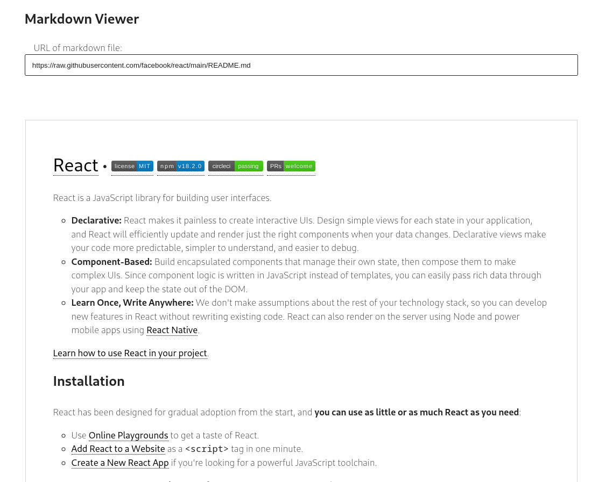

# Markdown Viewer

## Introduction

Markdown Viewer is a web application built with React, designed to render Markdown files directly from URLs. It's a handy tool for viewing and sharing Markdown content seamlessly in a browser.



## Features

- **URL-based Markdown Rendering**: Users can input a URL linking to a Markdown (.md) file, and the app will render it on the screen.
- **Markdown Parsing with React**: Utilizes `react-markdown` for converting Markdown into React components.
- **Syntax Highlighting**: Implements `react-syntax-highlighter` for enhanced code readability within Markdown files.
- **Data Fetching and Caching**: Leverages `tanstack/react-query` for efficient data fetching and caching of Markdown content.
- **Modern Bundling with Vite**: Built using Vite, ensuring fast development and optimized production builds.

## Installation and Setup

To set up Markdown Viewer locally, follow these steps:

1. Clone the repository:
   ```bash
   git clone git@github.com:galiprandi/react-markdown.git
   ```
2. Navigate to the project directory:

   ```bash
   cd markdown-viewer
   ```

3. Install dependencies:

   ```bash
   npm install
   ```

4. Start the development server:
   ```bash
   npm run dev
   ```

## Usage

1. Open the application in your web browser.
2. Enter the URL of the Markdown file you want to view in the input field.
3. Click the 'Render' button to display the Markdown content.
4. Here is an example of how to use the application:

## Contribution

If you wish to contribute to the project, please read our Contribution Guide.

## License

This project is licensed under the MIT License. For more details, please see the LICENSE file.

## Credits

Thanks to everyone who has contributed to this project.

## Author

Markdown Viewer is developed by Germán Aliprandi. For inquiries, suggestions, or contributions, feel free to get in touch:

Name: Germán Aliprandi
Email: galiprandi@gmail.com
